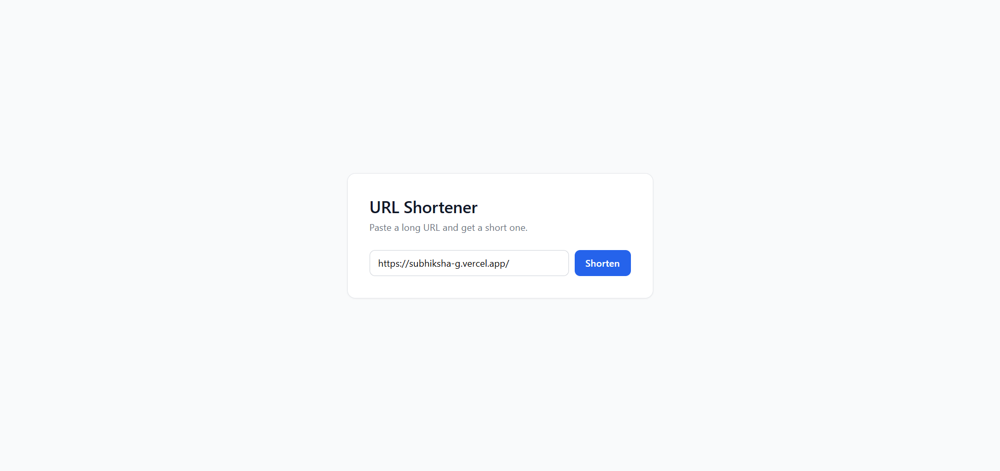
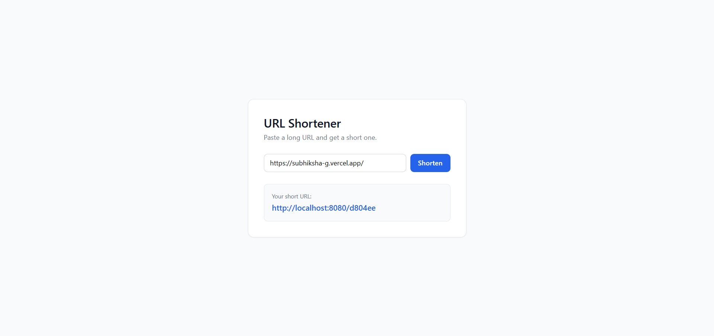

# URL Shortener


A full-stack URL shortener built with **Spring Boot** (backend) and **React (Vite)** (frontend), backed by **MongoDB**. Paste a long URL and get a short, shareable one.

---

## About This Project

A URL shortening service that takes a long URL and returns a compact, shareable short link, redirecting visitors back to the original destination.

### Long URL Input


### Shortened URL Result


---

## Tech Stack

**Frontend**
- React (Vite)

**Backend**
- Spring Boot (Java)
- MongoDB (via Spring Data MongoDB)

**Database**
- MongoDB (local instance or MongoDB Atlas)

---

## Features

- Shorten any long URL into a compact, shareable link
- Redirect from the short URL to the original long URL
- CORS-configured for safe cross-origin requests

---

## Project Structure

```
url-shortener/
├── backend/
│   └── src/main/resources/application.properties
├── frontend/
└── screenshots/
    ├── long-url-input.png
    └── shortened-url-result.png
```

---

## Setup Instructions (Run Locally)

### Prerequisites

- Java 17+ and Maven
- Node.js and npm
- A local MongoDB instance (or a MongoDB Atlas cluster with your IP whitelisted)

### 1. Clone the repo

```bash
git clone https://github.com/subhiksha1196/url-shortener.git
cd url-shortener
```

### 2. Backend setup

```bash
cd backend
```

Set environment variables as needed (or rely on the local defaults in `application.properties`):

| Variable          | Purpose                                       | Local Default                              |
|-------------------|------------------------------------------------|---------------------------------------------|
| `MONGODB_URI`     | MongoDB connection string                     | `mongodb://localhost:27017/urlshortenerdb`   |
| `PORT`            | Server port                                    | `8080`                                       |
| `APP_BASE_URL`    | Base URL used to build the short link         | `http://localhost:8080`                      |
| `ALLOWED_ORIGINS` | Comma-separated list of allowed CORS origins  | `http://localhost:5173`                      |

Run the backend:

```bash
mvn spring-boot:run
```

### 3. Frontend setup

```bash
cd frontend
npm install
npm run dev
```

By default, the frontend will call the backend at `http://localhost:8080`.

### 4. Try it out

Open `http://localhost:5173`, paste a long URL, and click **Shorten**.

---

## Author

[Subhiksha](https://subhiksha-g.vercel.app)
